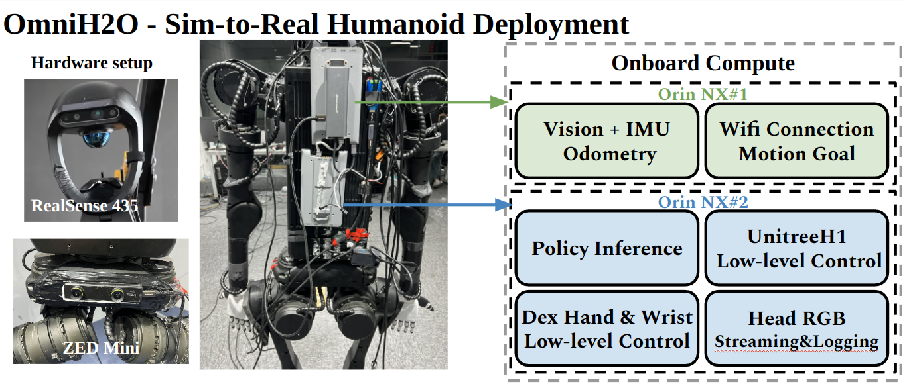

<h1 align="center">Human to Humanoid</h1>

Official Implementation for [H2O](https://human2humanoid.com/) and [OmniH2O](https://omni.human2humanoid.com/):
- [Learning Human-to-Humanoid Real-Time Whole-Body Teleoperation](https://human2humanoid.com/), IROS 2024.
- [OmniH2O: Universal and Dexterous Human-to-Humanoid Whole-Body Teleoperation and Learning](https://omni.human2humanoid.com/), CoRL 2024.


<div style="display: flex; align-items: center;">
    
    
</div>


This codebase is under [CC BY-NC 4.0 license](https://creativecommons.org/licenses/by-nc/4.0/deed.en), with inherited license in [Legged Gym](training/legged_gym) and [RSL RL](training/rsl_rl) from *ETH Zurich, Nikita Rudin* and *NVIDIA CORPORATION & AFFILIATES*. You **may not use the material for commercial purposes**, e.g., to make demos to advertise your commercial products.

Please read through the whole README.md before cloning the repo.

# Installation

**Note**: Before running our code, it's highly recommended to first play with [RSL's Legged Gym version](https://github.com/leggedrobotics/legged_gym) to get a basic understanding of the Isaac-LeggedGym-RslRL framework.
   <!-- <br/><br/> -->

1. Create environment and install torch

   ```text
   conda create -n omnih2o python=3.8 
   conda activate omnih2o
   pip3 install torch torchvision torchaudio 
   ```

   

2. Install Isaac Gym preview 4 release https://developer.nvidia.com/isaac-gym

   unzip files to a folder, then install with pip:

   `cd isaacgym/python && pip install -e .`

   check it is correctly installed by playing: 

   ```cmd
   cd examples && python 1080_balls_of_solitude.py
   ```

   

3. Clone this codebase and install our `rsl_rl` in the training folder

   ```cmd
   pip install -e rsl_rl
   ```


4. Install our `legged_gym`

   ```cmd
   pip install -e legged_gym
   ```

   Ensure you have installed the following packages:
    + pip install numpy==1.20 (must < 1.24)
    + pip install tensorboard
    + pip install setuptools==59.5.0

5. Install our `phc`

   ```cmd
   pip install -e phc
   ```

6. Install additional packages `requirements.txt`

   ```cmd
   pip install -r requirements.txt
   ```


# Training and Playing

1. Try training and playing **privileged teacher policy**.

   can use "--headless" to disable gui, press "v" to pause/resume gui play.

    ```text
   # OmniH2O Training and Playing Teacher Policy 
   python legged_gym/scripts/train_hydra.py --config-name=config_teleop task=h1:teleop run_name=OmniH2O_TEACHER env.num_observations=913 env.num_privileged_obs=990 motion.teleop_obs_version=v-teleop-extend-max-full motion=motion_full motion.extend_head=True num_envs=4096 asset.zero_out_far=False asset.termination_scales.max_ref_motion_distance=1.5 sim_device=cuda:0 motion.motion_file=resources/motions/h1/stable_punch.pkl rewards=rewards_teleop_omnih2o_teacher rewards.penalty_curriculum=True rewards.penalty_scale=0.5

   # OmniH2O Play Teacher Policy
    python  legged_gym/scripts/play_hydra.py --config-name=config_teleop task=h1:teleop env.num_observations=913 env.num_privileged_obs=990 motion.future_tracks=True motion.teleop_obs_version=v-teleop-extend-max-full motion=motion_full  motion.extend_head=True asset.zero_out_far=False asset.termination_scales.max_ref_motion_distance=10.0  sim_device=cuda:0 load_run=OmniH2O_TEACHER checkpoint=XXXX num_envs=1 headless=False
   ```
2. Try training and playing **sim2real deploy policy**.
   ```text
   # OmniH2O Distill Student Policy
   python legged_gym/scripts/train_hydra.py --config-name=config_teleop task=h1:teleop run_name=OmniH2O_STUDENT env.num_observations=1665 env.num_privileged_obs=1742 motion.teleop_obs_version=v-teleop-extend-vr-max-nolinvel motion.teleop_selected_keypoints_names=[] motion.extend_head=True num_envs=4096 asset.zero_out_far=False asset.termination_scales.max_ref_motion_distance=1.5 sim_device=cuda:0 motion.motion_file=resources/motions/h1/stable_punch.pkl rewards=rewards_teleop_omnih2o_teacher rewards.penalty_curriculum=True rewards.penalty_scale=0.5 train.distill=True train.policy.init_noise_std=0.001 env.add_short_history=True env.short_history_length=25 noise.add_noise=False noise.noise_level=0 train.dagger.load_run_dagger=TEACHER_RUN_NAME train.dagger.checkpoint_dagger=XXX train.dagger.dagger_only=True

   # OmniH2O Play Student Policy
   python legged_gym/scripts/play_hydra.py --config-name=config_teleop task=h1:teleop env.num_observations=1665 env.num_privileged_obs=1742 motion.teleop_obs_version=v-teleop-extend-vr-max-nolinvel motion.teleop_selected_keypoints_names=[] motion.extend_head=True num_envs=1 asset.zero_out_far=False asset.termination_scales.max_ref_motion_distance=10.0 sim_device=cuda:0 load_run=OmniH2O_STUDENT checkpoint=XXXX env.add_short_history=True env.short_history_length=25 headless=False 

   ```

3. Different Configurations on **Hisotry Steps**

    **0-step MLP**
    ```text
    # OmniH2O Distill 0-step MLP Student Policy 
    python legged_gym/scripts/train_hydra.py --config-name=config_teleop task=h1:teleop run_name=OmniH2O_STUDENT_0stepMLP env.num_observations=90 env.num_privileged_obs=167 motion.teleop_obs_version=v-teleop-extend-vr-max-nolinvel motion.teleop_selected_keypoints_names=[] motion.extend_head=True num_envs=4096 asset.zero_out_far=False asset.termination_scales.max_ref_motion_distance=1.5 sim_device=cuda:0 motion.motion_file=resources/motions/h1/stable_punch.pkl rewards=rewards_teleop_omnih2o_teacher rewards.penalty_curriculum=True rewards.penalty_scale=0.5 train.distill=True train.policy.init_noise_std=0.001 env.add_short_history=False noise.add_noise=False noise.noise_level=0 train.dagger.load_run_dagger=TEACHER_RUN_NAME train.dagger.checkpoint_dagger=XXX train.dagger.dagger_only=True

    # OmniH2O Play 0-step MLP Student Policy 
    python legged_gym/scripts/play_hydra.py --config-name=config_teleop task=h1:teleop env.num_observations=90 env.num_privileged_obs=167 motion.teleop_obs_version=v-teleop-extend-vr-max-nolinvel motion.teleop_selected_keypoints_names=[] motion.extend_head=True num_envs=1 asset.zero_out_far=False asset.termination_scales.max_ref_motion_distance=10.0 sim_device=cuda:0 load_run=OmniH2O_STUDENT checkpoint=XXXX env.add_short_history=False headless=False 
    ```

    **5-step MLP**
    ```text
    # OmniH2O Distill 5-step MLP Student Policy 
    python legged_gym/scripts/train_hydra.py --config-name=config_teleop task=h1:teleop run_name=OmniH2O_STUDENT_50stepMLP env.num_observations=405 env.num_privileged_obs=482 motion.teleop_obs_version=v-teleop-extend-vr-max-nolinvel motion.teleop_selected_keypoints_names=[] motion.extend_head=True num_envs=4096 asset.zero_out_far=False asset.termination_scales.max_ref_motion_distance=1.5 sim_device=cuda:0 motion.motion_file=resources/motions/h1/stable_punch.pkl rewards=rewards_teleop_omnih2o_teacher rewards.penalty_curriculum=True rewards.penalty_scale=0.5 train.distill=True train.policy.init_noise_std=0.001 env.add_short_history=True env.short_history_length=5 noise.add_noise=False noise.noise_level=0 train.dagger.load_run_dagger=TEACHER_RUN_NAME train.dagger.checkpoint_dagger=XXX train.dagger.dagger_only=True

    # OmniH2O Play 5-step MLP Student Policy 
    python legged_gym/scripts/play_hydra.py --config-name=config_teleop task=h1:teleop env.env.env.num_observations=405 env.num_privileged_obs=482 motion.teleop_obs_version=v-teleop-extend-vr-max-nolinvel motion.teleop_selected_keypoints_names=[] motion.extend_head=True num_envs=1 asset.zero_out_far=False asset.termination_scales.max_ref_motion_distance=10.0 sim_device=cuda:0 load_run=OmniH2O_STUDENT checkpoint=XXXX env.add_short_history=True env.short_history_length=5 headless=False 
    ```

    **50-step MLP**
    ```text
    # OmniH2O Distill 50-step MLP Student Policy 
    python legged_gym/scripts/train_hydra.py --config-name=config_teleop task=h1:teleop run_name=OmniH2O_STUDENT_50stepMLP env.num_observations=3240 env.num_privileged_obs=3317 motion.teleop_obs_version=v-teleop-extend-vr-max-nolinvel motion.teleop_selected_keypoints_names=[] motion.extend_head=True num_envs=4096 asset.zero_out_far=False asset.termination_scales.max_ref_motion_distance=1.5 sim_device=cuda:0 motion.motion_file=resources/motions/h1/stable_punch.pkl rewards=rewards_teleop_omnih2o_teacher rewards.penalty_curriculum=True rewards.penalty_scale=0.5 train.distill=True train.policy.init_noise_std=0.001 env.add_short_history=True env.short_history_length=50 noise.add_noise=False noise.noise_level=0 train.dagger.load_run_dagger=TEACHER_RUN_NAME train.dagger.checkpoint_dagger=XXX train.dagger.dagger_only=True

    # OmniH2O Play 50-step MLP Student Policy 
    python legged_gym/scripts/play_hydra.py --config-name=config_teleop task=h1:teleop env.env.num_observations=3240 env.num_privileged_obs=3317 motion.teleop_obs_version=v-teleop-extend-vr-max-nolinvel motion.teleop_selected_keypoints_names=[] motion.extend_head=True num_envs=1 asset.zero_out_far=False asset.termination_scales.max_ref_motion_distance=10.0 sim_device=cuda:0 load_run=OmniH2O_STUDENT checkpoint=XXXX env.add_short_history=True env.short_history_length=50 headless=False 
    ```
   

    

4. Different Configurations on **Hisotry Architectures**

    **LSTM**
    ```text
    # OmniH2O Distill LSTM Student Policy 
    python legged_gym/scripts/train_hydra.py --config-name=config_teleop task=h1:teleop run_name=LSTM_STUDENT env.num_observations=90 env.num_privileged_obs=167 motion.teleop_obs_version=v-teleop-extend-vr-max-nolinvel motion.teleop_selected_keypoints_names=[] motion.extend_head=True num_envs=4096 asset.zero_out_far=False asset.termination_scales.max_ref_motion_distance=1.5 sim_device=cuda:0 motion.motion_file=resources/motions/h1/stable_punch.pkl rewards=rewards_teleop_omnih2o_teacher rewards.penalty_curriculum=False rewards.penalty_scale=0.5 train.distill=True train.policy.init_noise_std=0.001 env.add_short_history=False env.short_history_length=0 noise.add_noise=False noise.noise_level=0 train.dagger.load_run_dagger=TEACHER_RUN_NAME train.dagger.checkpoint_dagger=55500 train.dagger.dagger_only=True train.runner.policy_class_name=ActorCriticRecurrent train.policy.rnn_type=lstm
    ```

    **GRU**
    ```text
    # OmniH2O Distill GRU Student Policy 
    python legged_gym/scripts/train_hydra.py --config-name=config_teleop task=h1:teleop run_name=LSTM_STUDENT env.num_observations=90 env.num_privileged_obs=167 motion.teleop_obs_version=v-teleop-extend-vr-max-nolinvel motion.teleop_selected_keypoints_names=[] motion.extend_head=True num_envs=4096 asset.zero_out_far=False asset.termination_scales.max_ref_motion_distance=1.5 sim_device=cuda:0 motion.motion_file=resources/motions/h1/stable_punch.pkl rewards=rewards_teleop_omnih2o_teacher rewards.penalty_curriculum=False rewards.penalty_scale=0.5 train.distill=True train.policy.init_noise_std=0.001 env.add_short_history=False env.short_history_length=0 noise.add_noise=False noise.noise_level=0 train.dagger.load_run_dagger=TEACHER_RUN_NAME train.dagger.checkpoint_dagger=55500 train.dagger.dagger_only=True train.runner.policy_class_name=ActorCriticRecurrent train.policy.rnn_type=gru
    ```


5. Different Configurations on **Observation Type (tracking points)**

    ```text
    # OmniH2O Distill 8-point Tracking Policy 
    python legged_gym/scripts/train_hydra.py --config-name=config_teleop task=h1:teleop run_name=OmniH2O_STUDENT_8point env.num_observations=1719 env.num_privileged_obs=1796 motion.teleop_obs_version=v-teleop-extend-vr-max-nolinvel motion.teleop_selected_keypoints_names=[left_ankle_link,right_ankle_link,left_shoulder_pitch_link,right_shoulder_pitch_link,left_elbow_link,right_elbow_link] motion.extend_head=True num_envs=4096 asset.zero_out_far=False asset.termination_scales.max_ref_motion_distance=1.5 sim_device=cuda:0 motion.motion_file=resources/motions/h1/stable_punch.pkl rewards=rewards_teleop_omnih2o_teacher rewards.penalty_curriculum=True rewards.penalty_scale=0.5 train.distill=True train.policy.init_noise_std=0.001 env.add_short_history=True env.short_history_length=25 noise.add_noise=False noise.noise_level=0 train.dagger.load_run_dagger=TEACHER_RUN_NAME train.dagger.checkpoint_dagger=XXX train.dagger.dagger_only=True

    # OmniH2O Distill 23-point Tracking Policy 
    python legged_gym/scripts/train_hydra.py --config-name=config_teleop task=h1:teleop run_name=OmniH2O_STUDENT_23point env.num_observations=1845 env.num_privileged_obs=1922 motion.teleop_obs_version=v-teleop-extend-vr-max-nolinvel motion.teleop_selected_keypoints_names=[pelvis,left_hip_yaw_link,left_hip_roll_link,left_hip_pitch_link,left_knee_link,left_ankle_link,right_hip_yaw_link,right_hip_roll_link,right_hip_pitch_link,right_knee_link,right_ankle_link,torso_link,left_shoulder_pitch_link,left_shoulder_roll_link,left_shoulder_yaw_link,left_elbow_link,right_shoulder_pitch_link,right_shoulder_roll_link,right_shoulder_yaw_link,right_elbow_link] motion.extend_head=True num_envs=4096 asset.zero_out_far=False asset.termination_scales.max_ref_motion_distance=1.5 sim_device=cuda:1 motion.motion_file=resources/motions/h1/stable_punch.pkl rewards=rewards_teleop_omnih2o_teacher rewards.penalty_curriculum=True rewards.penalty_scale=0.5 train.distill=True train.policy.init_noise_std=0.001 env.add_short_history=True env.short_history_length=25 noise.add_noise=False noise.noise_level=0 train.dagger.load_run_dagger=TEACHER_RUN_NAME train.dagger.checkpoint_dagger=XXX train.dagger.dagger_only=True
    ```

6. Different Configurations on **Observation Type (with linear velocity)**

    ```text
    # OmniH2O Distill Student Policy with Linear Velocity
    python legged_gym/scripts/train_hydra.py --config-name=config_teleop task=h1:teleop run_name=OmniH2O_STUDENT env.num_observations=1743 env.num_privileged_obs=1820 motion.teleop_obs_version=v-teleop-extend-vr-max motion.teleop_selected_keypoints_names=[] motion.extend_head=True num_envs=4096 asset.zero_out_far=False asset.termination_scales.max_ref_motion_distance=1.5 sim_device=cuda:0 motion.motion_file=resources/motions/h1/stable_punch.pkl rewards=rewards_teleop_omnih2o_teacher rewards.penalty_curriculum=True rewards.penalty_scale=0.5 train.distill=True train.policy.init_noise_std=0.001 env.add_short_history=True env.short_history_length=25 noise.add_noise=False noise.noise_level=0 train.dagger.load_run_dagger=TEACHER_RUN_NAME train.dagger.checkpoint_dagger=XXX train.dagger.dagger_only=True
    ```


7. Different Configurations on **Training Pipeline (without DAgger)**

    ```text
    # OmniH2O Train Sim2Real Policy with RL directly
    python legged_gym/scripts/train_hydra.py --config-name=config_teleop task=h1:teleop run_name=OmniH2O_wo_DAgger env.num_observations=1665 env.num_privileged_obs=1742 motion.teleop_obs_version=v-teleop-extend-vr-max-nolinvel motion.teleop_selected_keypoints_names=[] motion.extend_head=True num_envs=4096 asset.zero_out_far=False asset.termination_scales.max_ref_motion_distance=1.5 sim_device=cuda:0 motion.motion_file=resources/motions/h1/stable_punch.pkl rewards=rewards_teleop_omnih2o_teacher rewards.penalty_curriculum=True rewards.penalty_scale=0.5 noise.add_noise=False noise.noise_level=0 env.add_short_history=True env.short_history_length=25
    ```

8. Train **H2O Policy** (8point tracking, no history, MLP, with linear velocity in the state space)

    ```text
    # H2O Train Sim2Real Policy (8point tracking, no history, MLP, with linear velocity) with RL directly
    python legged_gym/scripts/train_hydra.py --config-name=config_teleop task=h1:teleop run_name=H2O_Policy env.num_observations=138 env.num_privileged_obs=215 motion.teleop_obs_version=v-teleop-extend-max motion.teleop_selected_keypoints_names=[left_ankle_link,right_ankle_link,left_shoulder_pitch_link,right_shoulder_pitch_link,left_elbow_link,right_elbow_link] motion.extend_head=False num_envs=4096 asset.zero_out_far=False asset.termination_scales.max_ref_motion_distance=1.5 sim_device=cuda:0 motion.motion_file=resources/motions/h1/stable_punch.pkl rewards=rewards_teleop_omnih2o_teacher rewards.penalty_curriculum=True rewards.penalty_scale=0.5 env.add_short_history=False
    ```


# Motion Retargeting


## AMASS Dataset Preparation
Download [AMASS Dataset](https://amass.is.tue.mpg.de/index.html) with `SMPL + H G` format and put it under `human2humanoid/data/AMASS/AMASS_Complete/`:
```
|-- human2humanoid
   |-- data
      |-- AMASS
         |-- AMASS_Complete 
               |-- ACCAD.tar.bz2
               |-- BMLhandball.tar.bz2
               |-- BMLmovi.tar.bz2
               |-- BMLrub.tar
               |-- CMU.tar.bz2
               |-- ...
               |-- Transitions.tar.bz2

```

And then `cd human2humanoid/data/AMASS/AMASS_Complete` extract all the motion files by running:
```
for file in *.tar.bz2; do
    tar -xvjf "$file"
done
```

Then you should have:
```
|-- human2humanoid
   |-- data
      |-- AMASS
         |-- AMASS_Complete 
               |-- ACCAD
               |-- BioMotionLab_NTroje
               |-- BMLhandball
               |-- BMLmovi
               |-- CMU
               |-- ...
               |-- Transitions

```

## SMPL Model Preparation

Download [SMPL](https://smpl.is.tue.mpg.de/download.php) with `pkl` format and put it under `human2humanoid/data/smpl/`, and you should have:
```
|-- human2humanoid
   |-- data
      |-- smpl
         |-- SMPL_python_v.1.1.0.zip
```

Then `cd human2humanoid/data/smpl` and  `unzip SMPL_python_v.1.1.0.zip`, you should have 
```
|-- human2humanoid
   |-- data
      |-- smpl
         |-- SMPL_python_v.1.1.0
            |-- models
               |-- basicmodel_f_lbs_10_207_0_v1.1.0.pkl
               |-- basicmodel_m_lbs_10_207_0_v1.1.0.pkl
               |-- basicmodel_neutral_lbs_10_207_0_v1.1.0.pkl
            |-- smpl_webuser
            |-- ...
```
Rename these three pkl files and move it under smpl like this:
```
|-- human2humanoid
   |-- data
      |-- smpl
         |-- SMPL_FEMALE.pkl
         |-- SMPL_MALE.pkl
         |-- SMPL_NEUTRAL.pkl
```

## Retargeting AMASS to specific humanoid robot

We use an 3-step process to retarget the AMASS dataset to specific humanoid embodiments. Taking `H1` as an example here
1. Write forward kinematics of `H1` in `human2humanoid/phc/phc/utils/torch_h1_humanoid_batch.py`
2. Fit the SMPL shape that matches the `H1` kinematics in `human2humanoid/scripts/data_process/grad_fit_h1_shape.py`
3. Retarget the AMASS dataset based on the corresponding keypoints between fitted SMLP shape and `H1` using `human2humanoid/scripts/data_process/grad_fit_h1.py`

```
cd human2humanoid
python scripts/data_process/grad_fit_h1_shape.py
```

And you should have 
```
|-- human2humanoid
   |-- data
      |-- h1
         |-- shape_optimized_v1.pkl 
```

### Retargetting
   

```
cd human2humanoid
python scripts/data_process/grad_fit_h1.py
```
You should have:
```
(h2o) tairanhe@tairanhe-PRO-WS-WRX80E-SAGE-SE:~/Workspace/human2humanoid$ python scripts/data_process/grad_fit_h1.py
Importing module 'gym_38' (/home/tairanhe/Workspace/isaacgym/isaacgym/python/isaacgym/_bindings/linux-x86_64/gym_38.so)
Setting GYM_USD_PLUG_INFO_PATH to /home/tairanhe/Workspace/isaacgym/isaacgym/python/isaacgym/_bindings/linux-x86_64/usd/plugInfo.json
2024-07-11 18:35:43,587 - INFO - logger - logger initialized
  0%|                                                                                                                                                                                                                              | 0/15886 [00:00<?, ?it/s]15886 Motions to process
0-AMASS_Complete_MPI_Limits_03101_ulr1b_poses Iter: 0    256.983:   0%|                                                                                                                                                             | 0/15886 [00:01<?, ?it/s
```
After this retargeting loop done, you should have your embodiment-specific dataset ready.

To visualize the retargeted motion, you can run:

```
python scripts/vis/vis_motion.py
```


### Downloading Full retargeted motion dataset after feasibility filter: 
Download motion file `amass_phc_filtered.pkl` [here](https://cmu.box.com/s/vfi619ox7lwf2hzzi710p3g2l59aeczv), and put it under `human2humanoid/legged_gym/resources/motions/h1/amass_phc_filtered.pkl`. Make sure your running command overwrites the default motion file by `motion.motion_file=resources/motions/h1/amass_phc_filtered.pkl`


# Real-World Deployment

## System Overview
<p align="center">
  
</p>

- **Robot**: [Unitree H1 EDU](https://shop.unitree.com/)
- **Perception**: [ZED mini Camera](https://store.stereolabs.com/products/zed-mini)
- **Onboard Compute**: [Orin NX (16GB)](https://www.seeedstudio.com/reComputer-J4012-p-5586.html)
- **Dexterous Hand**: [Inspire Hand](https://inspire-robots.store/collections/the-dexterous-hands?srsltid=AfmBOooJTL25MrQzRKIq5WQHDwr8ozIdlNQOdckJesxYqxeZ4uqj4Z4C)
- **Wrist Motor**: [DM-J4310-2EC](https://github.com/dmBots/DM-J4310-2EC)

## Deployment Code 

- **Unitree H1**: [Unitree H1 SDK](https://github.com/unitreerobotics/unitree_sdk2)
- **Inspire Hand**: [Inspire Hand (Unitree SDK)](hardware_code/inspire_hand.cpp)
- **Wrist Motor**: [Damiao c++ controller](hardware_code/damiao_wrist.cpp)
- **Vision Pro**: Please refer to [VisionProTeleop](https://github.com/Improbable-AI/VisionProTeleop) and [OpenTelevision](https://github.com/OpenTeleVision/TeleVision)
- **RGB Pose Estimation**: Please refer to [HybrIK](https://github.com/Jeff-sjtu/HybrIK)
- **Diffusion Policy**: Please refer to [Diffusion Policy](https://github.com/real-stanford/diffusion_policy) and [HATO](https://github.com/toruowo/hato)
- **Odometry**: [ZED mini SDK](hardware_code/zed_odometry.py)


# Trouble Shooting

## Contact
+ Deployment and Policy Learning in Sim: Tairan He, tairanh@andrew.cmu.edu
+ Motion Retargeting: Zhengyi Luo, zluo2@cs.cmu.edu

## Issues
You can create an issue if you meet any bugs, except:
+ If you cannot run the [vanilla RSL's Legged Gym](https://github.com/leggedrobotics/legged_gym), it is expected that you first go to the vanilla Legged Gym repo for help.
+ There can be CUDA-related errors when there are too many parallel environments on certain PC+GPU+driver combination: we cannot solve thiss, you can try to reduce num_envs.
+ Our codebase is only for our hardware system showcased above. We are happy to make it serve as a reference for the community, but we won't tune it for your own robots.


# Citation

This codebase builds upon prior work. Please adhere to the relevant licensing in the respective repositories.
If you use this code in your work, please consider citing our works:

```bibtex
@inproceedings{he2024learning,
  title={Learning human-to-humanoid real-time whole-body teleoperation},
  author={He, Tairan and Luo, Zhengyi and Xiao, Wenli and Zhang, Chong and Kitani, Kris and Liu, Changliu and Shi, Guanya},
  journal={arXiv preprint arXiv:2403.04436},
  year={2024}
}

@inproceedings{he2024omnih2o,
  title={OmniH2O: Universal and Dexterous Human-to-Humanoid Whole-Body Teleoperation and Learning},
  author={He, Tairan and Luo, Zhengyi and He, Xialin and Xiao, Wenli and Zhang, Chong and Zhang, Weinan and Kitani, Kris and Liu, Changliu and Shi, Guanya},
  journal={arXiv preprint arXiv:2406.08858},
  year={2024}
}
```

Also consider citing these prior works that helped contribute to this project:

```bibtex
@inproceedings{luo2023perpetual,
  title={Perpetual humanoid control for real-time simulated avatars},
  author={Luo, Zhengyi and Cao, Jinkun and Kitani, Kris and Xu, Weipeng and others},
  booktitle={Proceedings of the IEEE/CVF International Conference on Computer Vision},
  pages={10895--10904},
  year={2023}
}

@inproceedings{rudin2022learning,
  title={Learning to walk in minutes using massively parallel deep reinforcement learning},
  author={Rudin, Nikita and Hoeller, David and Reist, Philipp and Hutter, Marco},
  booktitle={Conference on Robot Learning},
  pages={91--100},
  year={2022},
  organization={PMLR}
}

@inproceedings{cheng2024open,
  title={Open-TeleVision: teleoperation with immersive active visual feedback},
  author={Cheng, Xuxin and Li, Jialong and Yang, Shiqi and Yang, Ge and Wang, Xiaolong},
  journal={arXiv preprint arXiv:2407.01512},
  year={2024}
}

@software{Park_Teleopeation_System_using,
author = {Park, Younghyo},
title = {{Teleopeation System using Apple Vision Pro}},
url = {https://github.com/Improbable-AI/VisionProTeleop},
version = {0.1.0}
}

@article{peng2018deepmimic,
  title={Deepmimic: Example-guided deep reinforcement learning of physics-based character skills},
  author={Peng, Xue Bin and Abbeel, Pieter and Levine, Sergey and Van de Panne, Michiel},
  journal={ACM Transactions On Graphics (TOG)},
  volume={37},
  number={4},
  pages={1--14},
  year={2018},
  publisher={ACM New York, NY, USA}
}


@article{lin2024learning,
   author={Lin, Toru and Zhang, Yu and Li, Qiyang and Qi, Haozhi and Yi, Brent and Levine, Sergey and Malik, Jitendra},
   title={Learning Visuotactile Skills with Two Multifingered Hands},
   journal={arXiv:2404.16823},
   year={2024}
}
```
